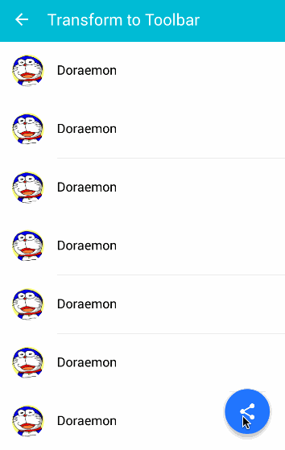
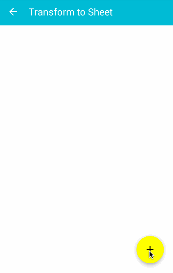

[](https://github.com/konifar/fab-transformation/blob/master/LICENSE)
[  ](https://bintray.com/konifar/maven/fab-transformation/_latestVersion)

# Fab Transformation
This library supports Floating Action Button transformation in [Material Design Guideline](https://www.google.com/design/spec/components/buttons-floating-action-button.html).

# Screenshot



# Sample App
<a href="https://play.google.com/store/apps/details?id=com.konifar.example.fabtransformation">
  
</a>

# Installation
Add the dependency (jcenter) to your `build.gradle`.
```groovy
dependencies {
    compile 'konifar:fab-transformation:1.0.0'
}
```

# How to use
This is footer toolbar transformation example.

## Layout
1. Put Floating Action Button and transform view in your layout.
2. Wrap transform view in Circular reveal container.

```xml
<RelativeLayout
    android:layout_width="match_parent"
    android:layout_height="match_parent">
    
    <!-- Any Fab is OK. (Third party library, your custom view and so on) -->
    <android.support.design.widget.FloatingActionButton
        android:id="@+id/fab"
        style="@style/FabMargin"
        android:layout_width="wrap_content"
        android:layout_height="wrap_content"
        android:layout_alignParentBottom="true"
        android:layout_alignParentRight="true"
        android:src="@drawable/ic_share_white_24dp"
        app:backgroundTint="@color/blue_accent200"
        app:borderWidth="0dp" />

    <!-- You must wrap transform view in Circular reveal container -->
    <io.codetail.widget.RevealFrameLayout
        android:layout_width="match_parent"
        android:layout_height="wrap_content"
        android:layout_alignParentBottom="true">

        <!-- Transform view -->
        <android.support.v7.widget.Toolbar
            android:id="@+id/toolbar_footer"
            android:layout_width="match_parent"
            android:layout_height="@dimen/footer"
            android:background="@color/blue_accent200"
            android:visibility="invisible">
            <!-- Put view you like -->
        </android.support.v7.widget.Toolbar>

    </io.codetail.widget.RevealFrameLayout>
</RelativeLayout>
```

## Java
### Transform fab to other view.
```java

FabTransformation.with(fab)
                 .transformTo(toolbarFooter);
```

### Transform other view to fab.
```java
FabTransformation.with(fab)
                 .transformFrom(toolbarFooter);
```

## Options
```java
FabTransformation.with(fab)
                 .overlay(overlayView)
                 .duration(500)
                 .setListener(new FabTransformation.OnTransformListener() {
                                @Override
                                public void onStartTransform() {
                                    // 
                                }

                                @Override
                                public void onEndTransform() {
                                    //
                                }
                 })
                 .transformFrom(toolbarFooter);
```

# Requirements
Android 2.3+

# Credits
This library use following libraries.
* [CircularReveal](https://github.com/ozodrukh/CircularReveal)
* [NineOldAndroids](https://github.com/JakeWharton/NineOldAndroids)

# Developed By
Yusuke Konishi (konifar) - <yahpeycoy0403@gmail.com>

# License
```
The MIT License (MIT)

Copyright (c) 2015 Yusuke Konishi

Permission is hereby granted, free of charge, to any person obtaining a copy
of this software and associated documentation files (the "Software"), to deal
in the Software without restriction, including without limitation the rights
to use, copy, modify, merge, publish, distribute, sublicense, and/or sell
copies of the Software, and to permit persons to whom the Software is
furnished to do so, subject to the following conditions:

The above copyright notice and this permission notice shall be included in all
copies or substantial portions of the Software.

THE SOFTWARE IS PROVIDED "AS IS", WITHOUT WARRANTY OF ANY KIND, EXPRESS OR
IMPLIED, INCLUDING BUT NOT LIMITED TO THE WARRANTIES OF MERCHANTABILITY,
FITNESS FOR A PARTICULAR PURPOSE AND NONINFRINGEMENT. IN NO EVENT SHALL THE
AUTHORS OR COPYRIGHT HOLDERS BE LIABLE FOR ANY CLAIM, DAMAGES OR OTHER
LIABILITY, WHETHER IN AN ACTION OF CONTRACT, TORT OR OTHERWISE, ARISING FROM,
OUT OF OR IN CONNECTION WITH THE SOFTWARE OR THE USE OR OTHER DEALINGS IN THE
SOFTWARE.
```
